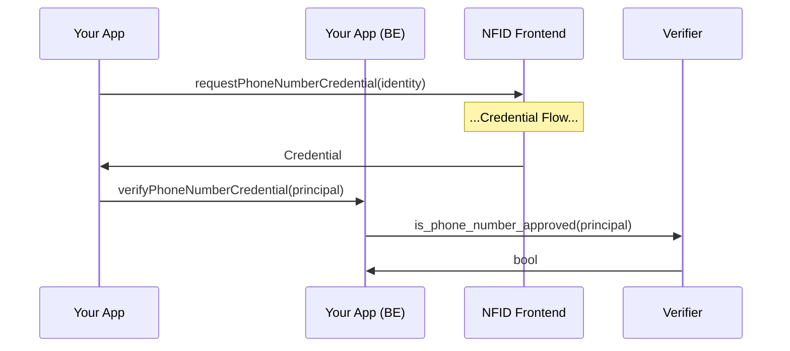

As an application developer, you may need to identify unique humans for airdrops, token allocations, governance, etc. NFID now supports a proof that the authenticated identity has or has not yet created an account with your application using the mobile phone number associated with their NFID.

## How the phone credential provides sybil-resitance

-   Each NFID can only have one non-removable mobile phone number
-   Each phone number goes through two layers of carrier status verification that checks against VOIP, scam, and risky numbers
-   Phone numbers are unique in NFID, guaranteeing no two NFIDs can ever have the same verified number
-   If an NFID has already proven their credential to your application from one NFID account, any attempts from other accounts of the same NFID will fail (ensuring users can't sybil attack your application with the same phone number)

## Requesting the phone credential

**`requestPhoneNumberCredential(identity: DelegationIdentity)`**

Verify that the user has a phone number associated with their account.

**Params**

-   `identity: DelegationIdentity` is a delegation identity retrieved from NFID via [the auth client](basic-installation).

**Returns**

-   `result`
    -   `status: "SUCCESS" | "REJECTED" | "ERROR"` indicates the result of the credential request. `SUCCESS` indicates the credential exists and you can proceed with verification. `REJECTED` indicates that the user has declined the request for a credential. `ERROR` indicates that something went wrong.
    -   `message?: string` In the case of a rejection or an error, additional details will be provided here.

**Note**

The credential should be validated with our blackhole canister for additional verification.

## Client Example

```sh
npm i @nfid/credentials;
```

### Requesting a Credential

An authenticated NFID identity is required in order to request a credential, so [handle authentication first](basic-installation).

```typescript
import { requestPhoneNumberCredential } from "@nfid/credentials";

const result = await requestPhoneNumberCredential(identity);
```

### Verifying a Credential

It is possible for a bad actor to attempt to manipulate a credential, and this necessitates a trustable method for verifying a credential. This is provided by the `is_phone_number_approved` method on our blackholed "verifier" canister, which is tamper proof and keeps hashed records of all phone number credentials. With this verification step, the complete flow would look like this:



The full interface for this method is </br>
`is_phone_number_approved(principal: string) : bool`</br>
and the canister id on mainnet is `gzqxf-kqaaa-aaaak-qakba-cai`.

```sh
dfx canister --network ic call gzqxf-kqaaa-aaaak-qakba-cai is_phone_number_approved '("principal-as-string", "phone-number-hash")'
```

The SDK provides a simple implementation:

```typescript
import { verifyPhoneNumberCredential } from "@nfid/credentials";

verifyPhoneNumberCredential(identity.getPrincipal().toText());
```
