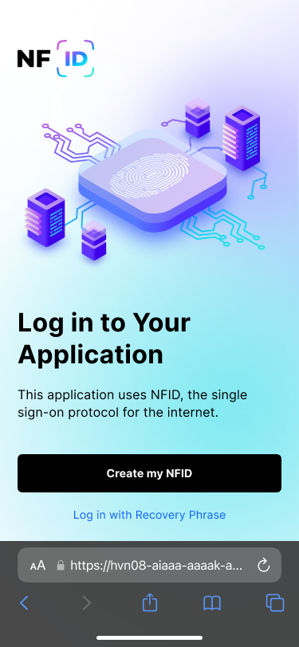

NFID provides a secure, frictionless authentication experience across all end-user devices and use cases—whether they are logging into your website or mobile app, confirming a transaction, performing a step-up authentication, or contacting your Call Center for support.

With NFID, users authenticate using FIDO-based device biometrics (or native biometrics for mobile apps). These biometric authenticators, such as fingerprint scanners, are already built into the desktop or mobile device. If their desktop device doesn’t support FIDO2, they can authenticate using a mobile device that does. For mobile devices that don’t support FIDO2, we are building alternative authentication methods like email verification code or verification link, though those are fundamentally less secure and we are working with Dfinity/you to find the right trade-off. Ultimately, users will authenticate using the strongest authentication method available for their device.

You don’t need to manage the registration status of users or devices, and explicitly request registration. All you need to do is request user authentication, and NFID will handle all the logic to determine whether to initiate a registration, authentication, or account recovery flow.

## Users without NFID
When a new user gets to your application without a previously registered NFID, they will need a FIDO-based device to create one.

### User starts on desktop
Upon clicking the button to Sign in with NFID, users will be presented with an option to scan a QR code with their phone or other sign in options, which at the moment is simply a method to recover a cleared local storage.
</img>
</img>
The web page will open the NFID registration flow where they'll go through the following steps:
- Create a WebAuthn keypair (either with the device biometric or security key)
- Enter captcha
- Sync the public key of their WebAuthn keypair and sign in to the app

If the user's desktop computer supports FIDO, users will be prompted with a question whether they want to log in faster on this computer.
</img>
As on the phone, users will have the ability register this computer to their list of trusted devices they can use WebAuthn to authenticate with.

If the user chose not to register their computer in this step, they'll be able to do so later.

At this point, you have the delegate identity with their principal ID.

### User starts on mobile
Upon clicking the button to Sign in with NFID, users will be navigated to the NFID registration screen where they'll go through the same steps as if they scanned a QR code from desktop:
</img>
- Create a WebAuthn keypair (either with the device biometric or security key)
- Enter captcha
- Sync the public key of their WebAuthn keypair and sign in to the app

At this point, you have the delegate identity with their principal ID.